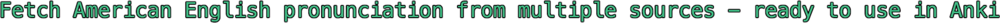

<!--- <h1 align="center" title="Project name"> Pronunciation Fetcher</h1> --->
<p align="center">
  <a href="">
    </a>
</p>


<p align="center">
    
</p>


<!-- Typing animation 
<div align="center">
  <a href="https://git.io/typing-svg">
    
  </a>
</div> -->


<!-- Project-specific badges -->
<div align="center">
  <a href="https://python.org" title="Supported python versions">
    </a>
  <a href="LICENSE" title="License">
    </a>
  <a href="https://github.com/psf/black" title="Code style">
    </a>
</div>


<details open>
    <summary><h2 align="left">Overview</h2> </summary>
    <div>
      Pronunciation Fetcher is a tool to get American English pronunciation audio files from various dictionary sources (see <a href="#available-sources">Available sources</a>). 
      Built as a component for an Anki flashcard workflow, it provides language learners with high-quality audio for vocabulary cards.
    </div>
</details>


<details open>
    <summary><h2 align="left">Features</h2></summary>
    <ul>
        <li>Downloads pronunciation audio in MP3 format</li>
        <li>Supports sets of up to 100 words</li>
        <li>Batch processing of multiple words with real-time progress reporting</li>
        <li>Detailed error handling and feedback</li>
    </ul>
</details>


<details>
    <summary><h2 align="left">Quick Start</h2></summary>

### Prerequisites

- Python 3.13 or higher

### Installation

1. **Clone the repository**
   ```bash
   git clone https://github.com/todmount/pronunciation-fetcher.git
   cd pronunciation-fetcher
   ```

2. **Set up a virtual environment**
   ```bash
   python -m venv venv
   source venv/bin/activate  # On Windows: venv\Scripts\activate
   ```

3. **Install dependencies**
   ```bash
   pip install -r requirements.txt
   ```

### Usage

> #### API key requirements
> Certain sources, such as [Merriam-Webster Dictionary API](https://dictionaryapi.com/) require you to get your own API key from their portal
> - **You’ll be prompted to enter your key when using such sources**
> - Additionally, you can manually place the key in a .env file
> - A .env.example file is provided to show the required format
> ```text
> # .env
> MW_API_KEY=your_api_key_here
> ```

Run the script and follow the interactive prompts:

```shellsession
foo@bar:~$ python3 pronunciation_fetcher.py

Enter words (comma-separated): dog, cat, mouse
Fetching Free Dictionary API...
[!] Found files in "downloads". Clear them? (Y/n): y
Processing words... 100%
[!] Some words failed. Show details? (Y/n): y
| Word  | Reason          |
|-------|-----------------|
| mouse | Audio not found |

```

In case of failed words, you will be prompted to use another source:

```shellsession
Would you like to re-fetch failed words from another source? (Y/n): y
Created directory: "downloads/failed_reattempts"
Scraping Oxford Learner's Dictionary...
Processing words... 100%
All words fetched successfully!
```
</details>


<details open>
    <summary><h2 align="left">Roadmap</h2></summary>

- [x] Implement Free Dictionary API fetching
- [x] Implement Merriam-Webster API fetching
- [x] Add .txt words format support
- [x] Integrate links to where to get API keys for specific sources
- [ ] Enact caching
- [ ] Package with PyPi

</details>


<details open>
    <summary><h2>Contributing</h2></summary>
    Contributions are welcome! Feel free to open an issue or submit a pull request
</details>


<details open>
    <summary><h2>Contact</h2></summary>
    See my <a href="https://github.com/Todmount">GitHub profile</a> for contact information
</details>

<details open>
    <summary><h2>License</h2></summary>
    Licensed under the MIT License. See the <a href="LICENSE">LICENSE</a> file for details
</details>

<details open>
    <summary><h2 align="left">Affiliations & Credits</h2></summary>
    <p align="left">
      <!-- Anki -->
      <a href="https://apps.ankiweb.net/">
        </a>
      &nbsp; <!-- for similar spacing -->
      <!-- Merriam-Webster -->
      <a href="https://www.merriam-webster.com/">
        </a> 
      &nbsp;&nbsp;&nbsp;
      <!-- Oxford -->
      <a href="https://www.oxfordlearnersdictionaries.com/">
        </a>
    </p>
    <details open id=disclaimer><summary>Disclaimer</summary>
      <div><sub>
        *Audio scraped from <b>Oxford Learner’s Dictionary</b> (unofficial, not affiliated with Oxford Languages)<br>
        **Designed for use with Anki. This project is independent and not affiliated with the official Anki project
        <p></p>
      </sub></div>
    </details>
    <details id=available-sources>
      <summary>Available sources</summary>
      <ul>
        <li><a href="https://dictionaryapi.dev/">Free Dictionary API</a></li>
        <li><a href="https://www.oxfordlearnersdictionaries.com/">Oxford Learner's Dictionary</a></li>
        <li><a href="https://dictionaryapi.com/">Merriam-Webster Learner's Dictionary API</a></li>
      </ul>
    </details>
</details>
